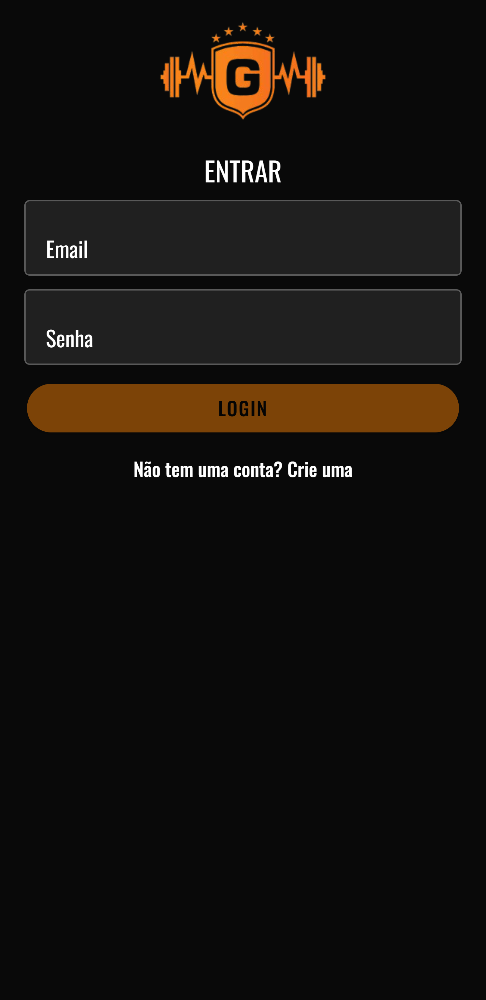
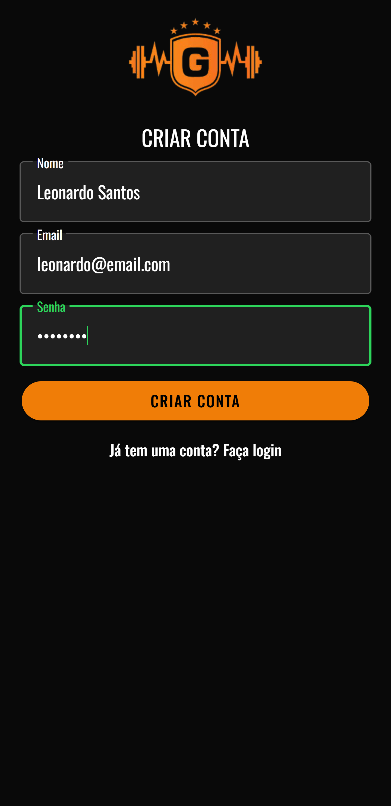
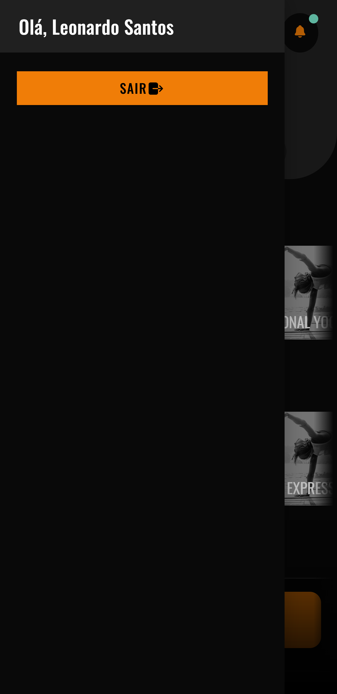

# Teste Técnico Be220!

### Foi Utilizado

- **Frontend**: Ionic/Angular;
- **Backend**: Firebase.

### Funcionalidades

O aplicativo oferece os seguintes destaques:

- Login
- Criar Conta
- Logout
- Responsividade

### Preview do App

- [be220.apk](demo/be220.apk)

